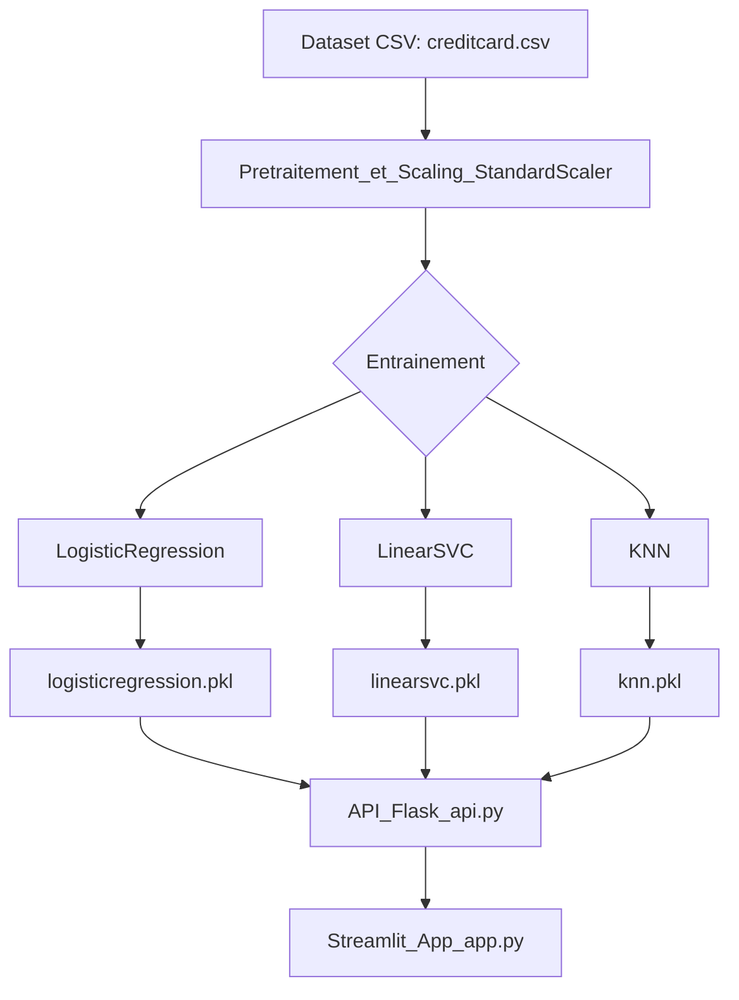

# Projet : Détection de Fraude Bancaire avec FraudGuard

## Présentation générale

FraudGuard permet de détecter les transactions bancaires frauduleuses à partir du dataset [creditcard.csv](https://www.kaggle.com/datasets/mlg-ulb/creditcardfraud).  
Le projet est découpé en plusieurs modules :

- Préparation et gestion des données
- Entraînement et sauvegarde de modèles ML
- Interface utilisateur Streamlit
- Base de données et authentification
- Automatisation CI/CD avec GitHub Actions

## Architecture du projet



Ce projet a pour objectif de démontrer un flux de travail complet (end-to-end) pour l'entraînement, le déploiement et l'utilisation d'un système de détection de fraude bancaire basé sur le Machine Learning. Il inclut la gestion des données, l'entraînement de plusieurs modèles, le déploiement d'une API Flask, une interface utilisateur Streamlit, et des fonctionnalités de base de données et d'authentification.

## Prérequis

### Environnement de développement

- Python 3.10
- Git ([Télécharger Git](https://git-scm.com/downloads))
- Anaconda ([Télécharger Anaconda](https://www.anaconda.com/products/distribution))
  - Lors de l'installation, cocher "ajouter anaconda aux variables d'environnement"
- Comptes sur GitHub, Render, et Streamlit Cloud

### Dépendances du projet

Créer un fichier `requirements.txt` avec les packages suivants :

```
numpy==1.26.4
pandas==2.2.3
scikit-learn==1.6.1
scipy==1.12.0
matplotlib==3.10.0
seaborn==0.13.2
keras==3.8.0
jupyterlab==4.3.5
ipython==8.21.0
ipykernel==6.29.5
ipywidgets==8.1.5
openml==0.15.1
mlxtend==0.23.4
imbalanced-learn==0.13.0
category_encoders==2.8.0
gdown==5.2.0
GPy==1.13.2
graphviz==0.20.3
streamlit==1.42.1
Flask==3.1.0
```

## Mise en place de l'environnement

1. Créer l'environnement Anaconda

   ```bash
   # Si vous n'avez pas déjà créé cet environnement avec anaconda-navigator
   conda create --name ml python=3.10

   # Activer l'environnement
   conda activate ml
   ```

2. Installer les dépendances
   ```bash
   # Se placer dans le dossier du projet contenant requirements.txt
   pip install -r requirements.txt
   ```

## Initialisation du projet Git

1. Initialiser le dépôt
   ```bash
   git init
   git config --global user.name "votre-nom"
   git config --global user.email "votre-email@example.com"
   ```
2. Ajouter les fichiers et faire un premier commit
   ```bash
   git add .
   git commit -m "Initial commit"
   ```
3. Créer un dépôt GitHub et lier le dépôt local
   ```bash
   git remote add origin https://github.com/votre-username/fraudguard.git
   git branch -M main
   git push -u origin main
   ```

## Structure du projet

```
fraudguard/
├── data/
│   └── creditcard.csv
├── model/
│   ├── confusion_matrix_KNN.png
│   ├── confusion_matrix_LinearSVC.png
│   ├── confusion_matrix_LogisticRegression.png
│   ├── knn.pkl
│   ├── linearsvc.pkl
│   ├── logisticregression.pkl
│   ├── scaler.pkl
│   └── train_model.py
├── app.py                # Interface Streamlit
├── api.py                # API Flask
├── database.py           # Gestion base de données utilisateurs
├── generate_transactions_csv.py  # Génération de transactions de test
├── sample_transactions.csv       # Transactions générées
├── requirements.txt
└── README.md
```

## Gestion des données et base de données

Le projet utilise plusieurs sources de données pour la détection de fraude :

1. Dataset principal : Le fichier `creditcard.csv` contient les transactions à analyser. Ces données sont normalisées à l'aide de StandardScaler, avec la colonne cible `Class` (0 = normale, 1 = fraude).

2. Base de données utilisateurs : Le fichier `database.py` gère l'authentification et la gestion des utilisateurs. Pour initialiser la base de données, exécutez :

   ```bash
   python database.py
   ```

   Ce script crée une nouvelle base de données SQLite et configure les tables nécessaires pour la gestion des utilisateurs.

3. Génération de transactions de test : Le fichier `generate_transactions_csv.py` permet de créer un ensemble de transactions de test basées sur le modèle de régression linéaire. Ces transactions sont sauvegardées dans `sample_transactions.csv` et peuvent être utilisées pour tester le système de détection de fraude. Pour générer de nouvelles transactions :
   ```bash
   python generate_transactions_csv.py
   ```

## Authentification

Le système d'authentification comprend deux fonctionnalités principales :

1. Inscription : Les nouveaux utilisateurs peuvent créer un compte en fournissant un nom d'utilisateur et un mot de passe. Le système vérifie la disponibilité du nom d'utilisateur et la force du mot de passe.

2. Connexion : Les utilisateurs existants peuvent se connecter avec leurs identifiants. Les mots de passe sont stockés de façon sécurisée (hashés) dans la base de données.

L'accès à certaines fonctionnalités est restreint aux utilisateurs authentifiés pour garantir la sécurité du système.

## Entraînement des modèles (model/train_model.py)

Le script `train_model.py` permet d'entraîner plusieurs modèles de classification :

- Chargement et prétraitement des données
- Division en train/test
- Entraînement de trois modèles :
  - Régression logistique (LogisticRegression)
  - SVM linéaire (LinearSVC)
  - K-Nearest Neighbors (KNN)
- Évaluation et sauvegarde des modèles (.pkl)
- Génération des matrices de confusion

Pour lancer l'entraînement :

```bash
python model/train_model.py
```

## Déploiement de l'API Flask (api.py)

L'API Flask fournit les fonctionnalités suivantes :

- Chargement des modèles sauvegardés
- Endpoint `/predict` : reçoit des données de transaction, retourne la prédiction (fraude ou non)
- Gestion des erreurs et validation des entrées
- Sécurité : possibilité de restreindre l'accès à l'API via authentification

Pour lancer l'API en local :

```bash
python api.py
```

L'API sera disponible sur `http://127.0.0.1:5000`.

## Interface utilisateur avec Streamlit (app.py)

L'interface Streamlit offre une expérience utilisateur complète :

- Connexion utilisateur (authentification)
- Formulaire de saisie ou upload de transaction
- Sélection du modèle à utiliser
- Affichage du résultat de la prédiction
- Visualisation des statistiques et matrices de confusion

Pour lancer l'interface Streamlit :

```bash
streamlit run app.py
```

## Comparaison et Analyse des Modèles de Détection de Fraude

### Résultats

| Modèle             | Accuracy | Précision (fraude) | Recall (fraude) | F1-score (fraude) |
| ------------------ | :------: | :----------------: | :-------------: | :---------------: |
| LogisticRegression |   1.00   |        0.83        |      0.64       |       0.72        |
| LinearSVC          |   1.00   |        0.83        |      0.59       |       0.69        |
| KNN                |   1.00   |        0.93        |      0.81       |       0.86        |

### Analyse

- Accuracy est identique pour tous les modèles (1.00) en raison du déséquilibre du dataset.
- Précision, Recall et F1-score sont donc des critères plus pertinents pour comparer les performances.
- KNN :
  - Meilleure précision (0.93) → Moins de fausses alertes de fraude.
  - Meilleur rappel (0.81) → Détecte plus de fraudes réelles.
  - Meilleur F1-score (0.86) → Excellent équilibre entre précision et rappel.

## Conclusion

Le modèle KNN est le meilleur choix pour la détection de fraude : il maximise à la fois la précision, le rappel et le F1-score, ce qui est crucial face au déséquilibre du dataset.

---

## 📄 Documentation complémentaire

- **`model/train_model.py`** : Script d'entraînement et de sauvegarde des modèles.
- **`api.py`** : Code de l'API Flask.
- **`app.py`** : Code de l'application Streamlit.
- **`database.py`** : Gestion des utilisateurs et de l'authentification.
- **`requirements.txt`** : Dépendances du projet.

